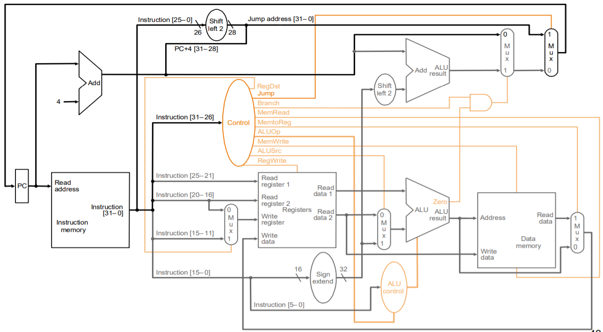
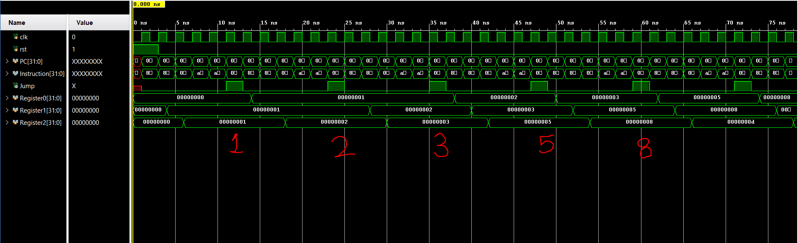
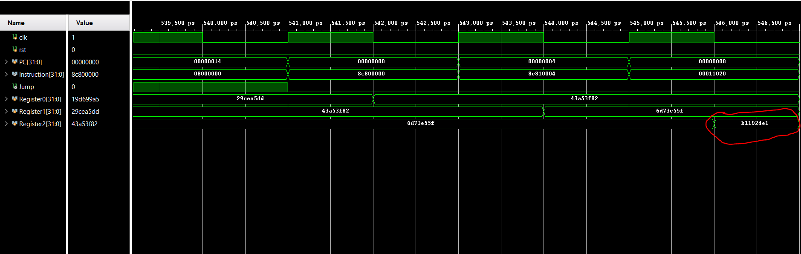

# MIPS-processor
Verilog implementation of a MIPS processor. This project started out as a lab assignment for SYSC 4310 (Computer Systems Architecture) Fall 2019.
I've built on the initial lab assignment and adding more funtionality and ISA support as time permits.

## Installation
1. Clone the repository or download files
2. Import source files into your favorite verilog simulator
3. Synthesize the design
4. Edit the test bench as necessary
5. Simulate

## Design
Implementation is based on this design


## Testing
Test bench loads the following program into memory. Program calculates the fibonacci sequence
```
_main:
      lw $t0, 0($s4)
      lw $t1, 4($s4)
      
      add $t2, $t0, $t1
      
      sw $t1, 0($s4)
      sw $t2, 4($s4)
      
      j _main
```
### Result
The beginning of the simulation

And we stop when we reach the largest unsigned 32 bit number 0xB11924E1


